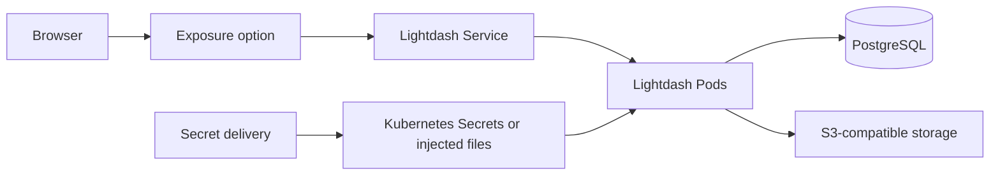

# Deploy a local Lightdash Helm chart to GKE

> [!CAUTION]
> This guide is a learning aid and may become outdated as Lightdash, Kubernetes,
> Helm, GCP, HCP Vault, and their command-line tools change. Do not run commands
> blindly. Check the current official documentation, pricing, security guidance,
> and your organization's policies first. The commands can create billable
> resources, change IAM and networking, expose services publicly, rotate
> credentials, or permanently delete data. Start in a non-production project,
> verify the active GCP project, Kubernetes context, and cloud account before each
> change, keep tested backups, and have production changes reviewed. Never paste
> credentials into Git, Helm values, tickets, chat, or terminal output captures.

This is the main, provider-neutral walkthrough. It keeps the steps that are common
to every deployment here and links to smaller guides whenever you must choose a
provider or operating model.

These instructions work from the upstream `main` branch, another branch, or a
fork. They deploy `./charts/lightdash` from whichever Git commit is currently
checked out. That is different from `lightdash/lightdash`, which installs the
published chart and does not contain unpublished changes from your local checkout.

## 1. Understand the pieces

- **GCP** is the cloud account and billing boundary.
- **GKE** runs Kubernetes for you. Kubernetes schedules containers as Pods.
- **Helm** turns this chart and your values files into Kubernetes resources.
- **PostgreSQL** stores Lightdash application data.
- **S3-compatible object storage** stores uploaded files and exports. It can be
  AWS S3, Google Cloud Storage's S3-compatible API, or MinIO.
- **Secret delivery** supplies passwords and keys through Kubernetes Secrets or
  files injected into Pods.
- **Ingress or a Service** makes Lightdash reachable from a browser.
- **A namespace** groups Kubernetes resources. This guide uses `lightdash`.
- **Workload Identity** lets a Kubernetes ServiceAccount use a cloud identity
  without a downloaded JSON key.

The setup order is important:

```text
1. GKE cluster
2. PostgreSQL and S3-compatible storage
3. Secret delivery and all required Kubernetes Secrets or injected files
4. Exposure prerequisites such as a static IP and DNS
5. Validate the local chart and selected values
6. Helm install: database migration -> Lightdash Pods -> Ingress
```

PostgreSQL and object storage must exist before Lightdash is installed. Every
Kubernetes Secret required by the selected delivery option must also exist before
Helm runs because the database migration is a pre-install hook.

After deployment, the runtime connections are:



## 2. Understand how to use this guide

You do not need to choose every component now. When you reach each dedicated
step—cluster, database, storage, secrets, and exposure—choose one option from the
table in that step and follow its linked document. Then return to this guide.

The database, storage, secret, and exposure steps each produce one values file
for the shared Helm workflow:

```text
.context/gke/database-values.yaml
.context/gke/object-storage-values.yaml
.context/gke/secrets-values.yaml
.context/gke/exposure-values.yaml
```

If you want a straightforward first path, select the recommended row in each
step: a new private GKE cluster, Cloud SQL, Google Cloud Storage, Kubernetes
Secrets, and GKE Ingress.

## 3. Prepare your Mac

Install or update the following tools:

```bash
brew update
brew install --cask google-cloud-sdk
brew install kubectl jq
gcloud components install gke-gcloud-auth-plugin
```

Install provider-specific CLIs only for the option you selected:

```bash
# Either HCP Vault option:
brew install hashicorp/tap/vault

# Amazon S3 only:
brew install awscli
```

This repository currently tests Helm `3.21.4`. Keep it separate from any Helm 4
binary already installed:

```bash
mkdir -p .context/bin
curl -fsSLo .context/helm.tgz \
  https://get.helm.sh/helm-v3.21.4-darwin-arm64.tar.gz
tar -xzf .context/helm.tgz -C .context
mv .context/darwin-arm64/helm .context/bin/helm3
chmod +x .context/bin/helm3
export PATH="$PWD/.context/bin:$PATH"
```

On an Intel Mac, change `darwin-arm64` to `darwin-amd64`. Verify everything:

```bash
gcloud version
gke-gcloud-auth-plugin --version
kubectl version --client
helm3 version --short
git branch --show-current
git status --short
```

Also run `vault version` or `aws --version` when that option is selected.

Do not continue if the Git branch is not the branch you intend to deploy. A dirty
working tree is allowed, but understand whether those local edits should be in the
deployment.

## 4. Set common variables

Run these commands from the repository root. Replace every `REPLACE_*` value.

```bash
export PROJECT_ID="REPLACE_GCP_PROJECT_ID"
export REGION="europe-west1"
export CLUSTER_NAME="lightdash-prod"
export NAMESPACE="lightdash"
export RELEASE="lightdash"
export LIGHTDASH_DOMAIN="lightdash.example.com"
export BRANCH_NAME="$(git branch --show-current)"
export GIT_SHA="$(git rev-parse --short=12 HEAD)"

mkdir -p .context/gke
git check-ignore -v .context/

cp docs/gke/base-values.yaml .context/gke/base-values.yaml
sed -i '' "s/REPLACE_GIT_SHA/$GIT_SHA/g" .context/gke/base-values.yaml
```

This repository's `.gitignore` excludes `.context/`, and the command above
verifies the rule before creating working files there.

An ignore rule is protection against accidental staging, not a security boundary:
`git add --force` can bypass it. Never put credentials in tracked files or Helm
values. The option guides use placeholders in tracked templates and create local
working copies under `.context/gke/`.

## 5. Prepare or connect to GKE

Choose one cluster option:

| Option | Use when | Compatibility and limitations |
| --- | --- | --- |
| **Recommended:** [new private regional GKE Standard cluster](gke/options/cluster-new-private-standard.md) | You control the GCP environment and want the complete setup | Creates a VPC, private nodes, Cloud NAT, Workload Identity, and ongoing GCP cost |
| [Existing GKE cluster](gke/options/cluster-existing.md) | A platform team already operates GKE | Must have network paths to the selected database, storage, and secret services; some changes require the cluster owner |

Both options must leave `kubectl` connected to the intended cluster.

Then perform this identity check before changing the cluster:

```bash
gcloud config get-value project
kubectl config current-context
kubectl cluster-info
kubectl get nodes -o wide
kubectl create namespace "$NAMESPACE" --dry-run=client -o yaml | kubectl apply -f -
```

The project, cluster, and region in the output must be the intended production
targets.

## 6. Configure PostgreSQL

Choose one database option:

| Option | Use when | Compatibility and limitations |
| --- | --- | --- |
| **Recommended:** [Cloud SQL for PostgreSQL](gke/options/database-cloud-sql.md) | You want managed PostgreSQL in GCP | Private IP requires VPC connectivity; the Auth Proxy uses Workload Identity; regional HA costs more |
| Existing PostgreSQL **[Coming soon]** | Your organization already operates PostgreSQL | Must be reachable from private GKE nodes and support TLS, backups, HA, and a least-privilege user |
| Bundled PostgreSQL **[Coming soon]** | Disposable learning environments only | Not a highly available production database |

When finished, this file must exist:

```bash
test -s .context/gke/database-values.yaml
```

## 7. Configure S3-compatible object storage

Lightdash uses the S3 API, but the service does not have to run in the same cloud.
Choose one storage option:

| Option | Use when | Compatibility and limitations |
| --- | --- | --- |
| **Recommended on GCP:** [Google Cloud Storage](gke/options/object-storage-gcs.md) | You want storage in the same cloud and region | Uses GCS's S3-compatible XML API and an HMAC key |
| [Amazon S3](gke/options/object-storage-aws-s3.md) | Your organization standardizes on AWS storage | Cross-cloud latency, egress cost, and a scoped AWS access key must be managed |
| [MinIO-compatible storage](gke/options/object-storage-minio.md) | Your organization already operates supported MinIO/AIStor | You own availability, upgrades, disks, TLS, public endpoint, and recovery; the former open-source Operator is archived |

Each guide prepares or verifies a private bucket, explains CORS and least
privilege, and tells you which two credentials must be delivered by the secret
option. When finished:

```bash
test -s .context/gke/object-storage-values.yaml
```

## 8. Deliver secrets

Choose one secret-delivery option:

| Option | Use when | Compatibility and limitations |
| --- | --- | --- |
| **Recommended:** [Kubernetes Secrets](gke/options/secrets-kubernetes.md) | You want the fewest components and can manage rotation operationally | Protect with RBAC and GKE application-layer encryption; changes require explicit Pod restarts |
| [HCP Vault with VSO](gke/options/secrets-vault-vso.md) | Your organization already uses HCP Vault and wants synchronized Kubernetes Secrets | Requires HCP Vault, GCP auth, Workload Identity, and VSO; produces three Kubernetes Secrets |
| [HCP Vault Agent Injector](gke/options/secrets-vault-injector.md) | Policy requires file injection into application Pods | Advanced hybrid: current chart limits still require two Kubernetes Secrets and explicit restarts |

All choices keep credential values out of Helm. Follow the selected option's
pre-install check before Helm runs. Kubernetes Secrets and VSO require these
three destination Secrets:

```bash
kubectl -n "$NAMESPACE" get secret \
  lightdash-application lightdash-database lightdash-s3
```

The required keys are:

| Secret | Key |
| --- | --- |
| `lightdash-application` | `LIGHTDASH_SECRET` |
| `lightdash-database` | `PGPASSWORD` |
| `lightdash-s3` | `S3_ACCESS_KEY`, `S3_SECRET_KEY` |

The Injector option is a documented hybrid: this chart still requires database
and migration values in `lightdash-database` and `lightdash-application`
Kubernetes Secrets, while application and S3 values are injected into backend
and worker Pods as files.

Also confirm the values fragment exists:

```bash
test -s .context/gke/secrets-values.yaml
```

This ordering is mandatory because the migration Job is a Helm pre-install hook.

## 9. Choose how users reach Lightdash

Choose one exposure option:

| Option | Use when | Compatibility and limitations |
| --- | --- | --- |
| **Recommended:** [GKE Ingress with managed HTTPS](gke/options/exposure-gke-ingress.md) | Users need a production domain and HTTPS | Requires a `ClusterIP` Service, global static IP, DNS control, and certificate provisioning time |
| LoadBalancer Service **[Coming soon]** | You need direct load-balancer exposure | Do not combine with GKE Ingress; TLS and redirects need another solution |
| Local port-forward **[Coming soon]** | Temporary setup or troubleshooting | Local access only; never a production endpoint |

Then check:

```bash
test -s .context/gke/exposure-values.yaml
```

## 10. Review the composed configuration

Helm applies values from left to right; later files override earlier ones:

```text
base -> database -> object storage -> secrets -> exposure
```

Search for forgotten placeholders. This command prints filenames only, not
secret values:

```bash
grep -IlR 'REPLACE_' .context/gke/*.yaml || true
```

If any filename is printed, edit it before proceeding. Then set reusable flags:

```bash
export BASE_VALUES=".context/gke/base-values.yaml"
export DATABASE_VALUES=".context/gke/database-values.yaml"
export STORAGE_VALUES=".context/gke/object-storage-values.yaml"
export SECRETS_VALUES=".context/gke/secrets-values.yaml"
export EXPOSURE_VALUES=".context/gke/exposure-values.yaml"
```

## 11. Validate without installing

Download chart dependencies, lint, and render for the target Kubernetes version:

```bash
helm3 repo add bitnami https://charts.bitnami.com/bitnami --force-update
helm3 repo add sagikazarmark https://charts.sagikazarmark.dev --force-update
helm3 repo add nats https://nats-io.github.io/k8s/helm/charts/ --force-update
helm3 repo update
helm3 dependency build charts/lightdash

helm3 lint charts/lightdash \
  --values "$BASE_VALUES" \
  --values "$DATABASE_VALUES" \
  --values "$STORAGE_VALUES" \
  --values "$SECRETS_VALUES" \
  --values "$EXPOSURE_VALUES"

helm3 template "$RELEASE" charts/lightdash \
  --namespace "$NAMESPACE" \
  --kube-version "1.35.0" \
  --values "$BASE_VALUES" \
  --values "$DATABASE_VALUES" \
  --values "$STORAGE_VALUES" \
  --values "$SECRETS_VALUES" \
  --values "$EXPOSURE_VALUES" \
  > .context/gke/rendered.yaml
```

The selected secret option must render no Lightdash-owned Secret objects:

```bash
if grep -q '^kind: Secret$' .context/gke/rendered.yaml; then
  echo "ERROR: Helm rendered a Secret; inspect before deploying" >&2
  exit 1
fi

grep -nE 'secretKeyRef:|serviceAccountName:|cloud-sql-proxy|/api/v1/readyz' \
  .context/gke/rendered.yaml
```

Ask the Kubernetes API to validate the rendered resources where possible. Helm
hook resources may not appear in this result until Helm installs them.

```bash
kubectl apply --dry-run=server -f .context/gke/rendered.yaml
```

## 12. Deploy the current checkout

The description records exactly what was deployed:

```bash
helm3 upgrade --install "$RELEASE" ./charts/lightdash \
  --namespace "$NAMESPACE" \
  --create-namespace \
  --values "$BASE_VALUES" \
  --values "$DATABASE_VALUES" \
  --values "$STORAGE_VALUES" \
  --values "$SECRETS_VALUES" \
  --values "$EXPOSURE_VALUES" \
  --description "branch=$BRANCH_NAME sha=$GIT_SHA" \
  --atomic \
  --wait \
  --wait-for-jobs \
  --timeout 20m
```

`./charts/lightdash` is essential: it selects the checked-out chart. Do not
replace it with the repository-qualified `lightdash/lightdash` name.

## 13. Verify the release

```bash
helm3 -n "$NAMESPACE" status "$RELEASE"
helm3 -n "$NAMESPACE" history "$RELEASE"
kubectl -n "$NAMESPACE" get pods,deployments,jobs,services,ingresses
kubectl -n "$NAMESPACE" wait deployment/lightdash-backend \
  --for=condition=Available --timeout=10m
kubectl -n "$NAMESPACE" wait deployment/lightdash-worker \
  --for=condition=Available --timeout=10m
```

Verify health using the URL or port-forward procedure in the selected exposure
guide:

```bash
curl -fsS "https://$LIGHTDASH_DOMAIN/api/v1/livez"
curl -fsS "https://$LIGHTDASH_DOMAIN/api/v1/readyz"
```

For a non-HTTPS option, replace the base URL. Finally:

1. Sign in and create the first organization.
2. Upload and download a file to prove object storage and browser CORS work.
3. Confirm at least two backend replicas are on different nodes when capacity
   permits: `kubectl -n lightdash get pods -o wide`.
4. Save the Helm revision shown by `helm history`.

## 14. Diagnose problems

```bash
kubectl -n "$NAMESPACE" get events --sort-by=.lastTimestamp
kubectl -n "$NAMESPACE" describe pod REPLACE_POD_NAME
kubectl -n "$NAMESPACE" logs REPLACE_POD_NAME -c lightdash --tail=200
kubectl -n "$NAMESPACE" logs REPLACE_POD_NAME -c cloud-sql-proxy --tail=200
kubectl -n "$NAMESPACE" get jobs
kubectl -n "$NAMESPACE" logs job/REPLACE_MIGRATION_JOB --all-containers
helm3 -n "$NAMESPACE" get values "$RELEASE" --all
helm3 -n "$NAMESPACE" get manifest "$RELEASE"
```

If using Vault Secrets Operator:

```bash
kubectl -n "$NAMESPACE" get vaultauth,vaultconnection,vaultstaticsecret
kubectl -n "$NAMESPACE" describe vaultstaticsecret lightdash-application
kubectl -n vault-secrets-operator logs deployment/vault-secrets-operator-controller-manager --tail=200
```

If using Vault Agent Injector:

```bash
kubectl -n vault-agent-injector get deployments,pods
kubectl get mutatingwebhookconfiguration \
  vault-agent-injector-agent-injector-cfg
kubectl -n vault-agent-injector logs \
  deployment/vault-agent-injector-agent-injector --tail=200
kubectl -n "$NAMESPACE" logs REPLACE_POD_NAME \
  -c vault-agent-init --tail=200
```

If using GKE Ingress:

```bash
kubectl -n "$NAMESPACE" describe ingress lightdash
kubectl -n "$NAMESPACE" get managedcertificate,frontendconfig,backendconfig
```

## 15. Upgrade and roll back

Check out or pull the desired branch, record the new SHA, repeat validation, then
repeat `helm upgrade --install`. Never use `--reuse-values` across chart changes;
explicit files make the deployment reproducible.

```bash
export GIT_SHA="$(git rev-parse --short=12 HEAD)"
sed -i '' -E "s/deployment-git-sha: .*/deployment-git-sha: \"$GIT_SHA\"/" \
  "$BASE_VALUES"
```

To roll back Kubernetes resources:

```bash
helm3 -n "$NAMESPACE" history "$RELEASE"
helm3 -n "$NAMESPACE" rollback "$RELEASE" REPLACE_REVISION \
  --wait --wait-for-jobs --timeout 20m
```

Database migrations may not be reversible. Read Lightdash release notes and take
a tested database backup before upgrades or rollbacks.

## 16. Operate and retire the environment

- Rotate the application, database, and storage credentials; verify that your
  secret option updates Pods without exposing values.
- Test database point-in-time recovery, not just backup creation.
- Review object versioning, retention, lifecycle rules, and restore procedures.
- Monitor certificates, Ingress health, Pod disruption budgets, and disk quotas.
- Export audit logs and test Vault snapshots if Vault is selected.

Teardown is provider-specific. Remove resources in this order, checking each
provider guide for deletion protection and retained data:

1. `helm3 -n "$NAMESPACE" uninstall "$RELEASE"`
2. exposure resources and reserved public IPs;
3. secret synchronization resources, but only after retaining required recovery
   credentials;
4. object storage only after exporting required files and clearing retention;
5. the database only after a verified final backup and disabling deletion
   protection intentionally;
6. the GKE cluster, NAT, subnet, and project.

Never make database or bucket deletion part of an unreviewed cleanup script.

## Primary references

- [Lightdash Helm chart documentation](https://docs.lightdash.com/self-host/deployment-options/helm)
- [Lightdash external object storage](https://docs.lightdash.com/self-host/customize-deployment/configure-lightdash-to-use-external-object-storage)
- [GKE documentation](https://cloud.google.com/kubernetes-engine/docs)
- [Helm values files](https://helm.sh/docs/chart_template_guide/values_files/)
